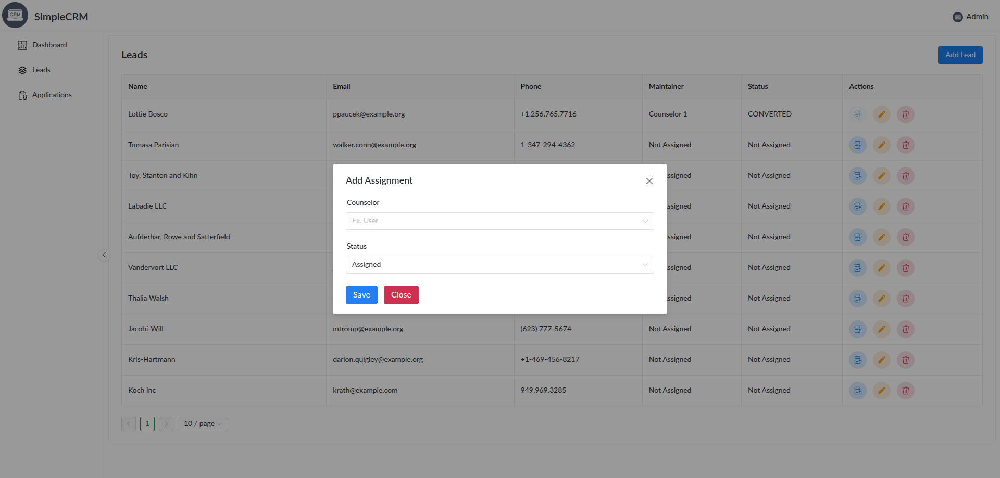

# SimpleCRM

A simple CRM for managing your customers and leads.

## Assignment Details

We require a mini CRM system where:

-   Leads are received and assigned to Counselors by an Admin. Let's say there will be four counsellors and one admin in this system.
-   When assigned counsellors start contacting leads, they would be able to change the lead status according to their conversation like "In progress", "Bad Timing", "Not Interested", and "Not Qualified"
-   If any lead is interested and move forward with their application, Our counsellor would have the ability to move them to application section.
-   In application section, assigned counsellor will select application status like "In Progress", "Approved", and "Rejection" according to the situation.

## Getting Started

These instructions will help you get a copy of the project up and running on your local machine.

## Built With

-   [Framework/Library] - Laravel 11
-   [Database] - MySQL
-   [Other tools] - TailwindCSS, Vue.js, Inertia.js

### Prerequisites

What things you need to install:

```bash
php 8.2+
composer

node.js v20+
npm or yarn

# PHP Extensions
-   Ctype
-   cURL
-   DOM
-   Fileinfo
-   Filter
-   Hash
-   Mbstring
-   OpenSSL
-   PCRE
-   PDO
-   Session
-   Tokenizer
-   XML
```

### Installation

1. Clone the repository

```bash
git clone https://github.com/ashrafemon/SimpleCRM.git
```

2. Install dependencies

```bash
# Backend dependencies
composer install

# Frontend dependencies
npm install
```

3. Environment Setup

```bash
cp .env.example .env

php artisan key:generate
php artisan jwt:secret

# Database Setup
DB_HOST=127.0.0.1
DB_PORT=3306
DB_DATABASE=simplecrm
DB_USERNAME=root
DB_PASSWORD=123456
```

4. Start the Frontend development server

```bash
npm run dev
```

5. Build the Frontend application

```bash
npm run build
```

6. Run the Backend application

```bash
php artisan migrate --seed
php artisan serve
```

The application will be available at `http://localhost:8000`

7. Default Credentials

-   Admin: `admin@crm.com`
-   Password: `123456`

-   Counsellors:
    -   `counselor1@crm.com`
    -   `counselor2@crm.com`
    -   `counselor3@crm.com`
    -   `counselor4@crm.com`
-   Password: `123456`

## Documentation

### API documentation can be found at `http://localhost:8000/request-docs`

### Preview


### Admin

<table>
    <tr>
        <td></td>
        <td></td>
    </tr>
    <tr>
        <td></td>
        <td></td>
    </tr>
    <tr>
        <td></td>
        <td></td>
    </tr>
</table>

### Counselor

<table>
    <tr>
        <td></td>
        <td></td>
    </tr>
    <tr>
        <td></td>
        <td></td>
    </tr>
</table>
